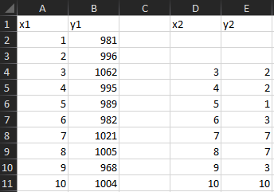
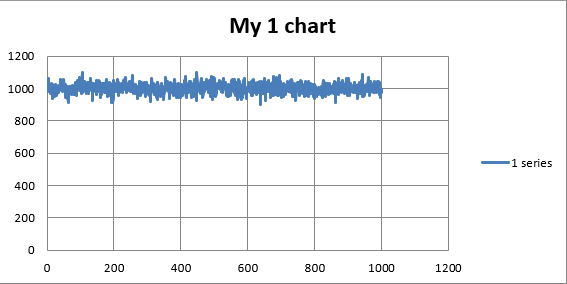
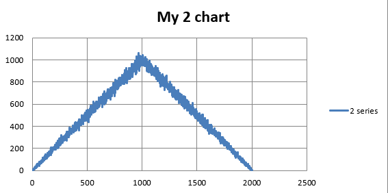
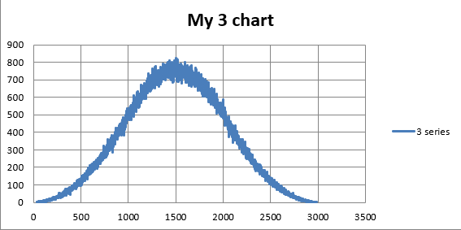

# Generate Excel with histograms
Creates a Excel .xlsx file with a spreadsheet showing calculations and result charts for histograms from a distribution calculated by summing up random values from a uniform distribution.

# Screenshots

# Skills used
- creating a spreadsheet in Excel and saving the results to the file using openpyxl module
- calculating the distributions using the numpy module

# Possible improvements
- improve calculations using different functions and structures
- improve spreadsheet visibility
- add more informations in charts
- experiment with other values/ranges/distributions
